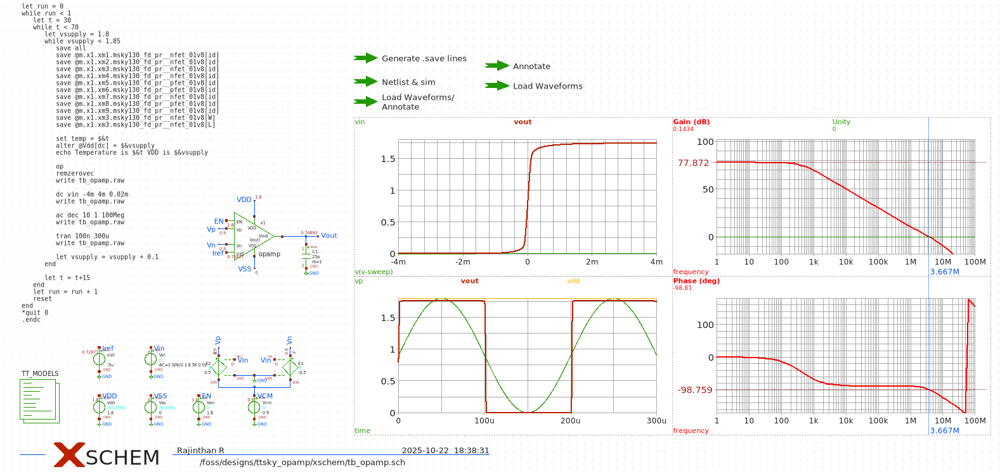
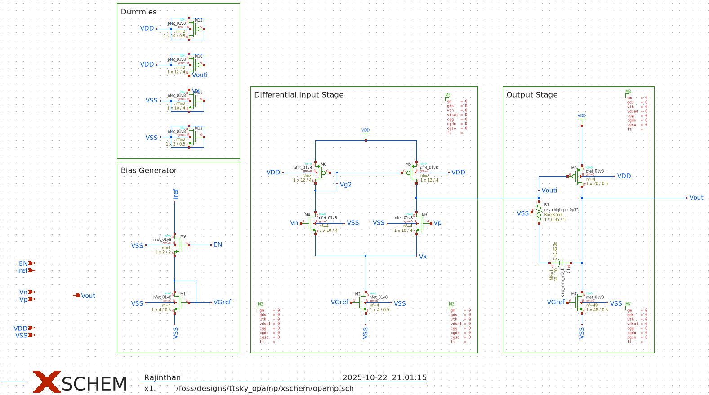
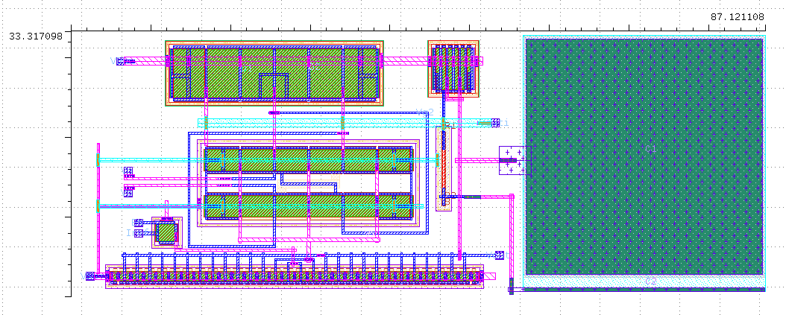

 

# ttsky_opamp

## What this project is

A single‑ended (SE) two‑stage CMOS operational amplifier designed for Tiny Tapeout.  
Architecture summary:
- Input: single‑ended common‑source input device with an active current‑mirror load.
- Second stage: common‑source gain stage.
- Compensation: Miller capacitor between stages for stability.
- On‑chip bias: simple current reference that provides Iref and load currents.
- Output: high‑impedance output node; intended to be used directly or with an external buffer.

Purpose: educational analog IP demonstrating a compact two‑stage op‑amp with on‑chip biasing suitable for tapeout and bench verification.

## Target specifications

(Design targets — verify against simulation and silicon measurements)
- Supply: VDD = 1.8 V, VSS = 0 V
- Reference bias: Iref = 5 µA (external precision source recommended)
- Nominal input common‑mode: ≈ 0.9 V
- Open‑loop DC gain: ≥ 60 dB (target)
- Unity‑gain / GBW: order of a few MHz (target; typical sims use up to 4 MHz stimulus)
- Phase margin: ≥ 45° (target; aim for 60° in closed‑loop)
- Input swing: ±0.2 V around nominal common‑mode (process dependent)
- Quiescent current: low µA–mA range depending on bias (tune with Iref)
- Load drive: intended for high‑impedance loads; add buffer for heavy loads

Replace or update these numbers with measured/simulated results as available.

## How to test the IC (bench / post‑silicon)

Safety and setup
- Use a current‑limited DC supply for VDD (start limit ≈ 5–10 mA).
- Place local decoupling close to power pins (0.1 µF ceramic + 10 µF bulk).
- Use a precision current source or SMU to source Iref = 5 µA into the Iref pin.
- Tie EN pin to VDD to enable the amplifier (pull to 0 V to disable).

Basic bench connection (voltage follower)
- Short Vout to Vp externally (wire or 0 Ω jumper) to configure as unity‑gain follower.
- Feed Vin (function generator) into Vp through an optional series resistor (10–50 Ω) if using a 50 Ω source.
- Probe Vout (and Vp) with oscilloscope; use differential probes or ensure proper ground referencing.

Recommended measurements
1. DC / bias
   - Measure node voltages, I(VDD), and Iref. Verify operating point against simulation.
2. AC small‑signal
   - Use a network analyzer or Bode setup: measure small‑signal closed‑loop gain, GBW, and phase margin.
3. Transient
   - Apply step/sine (DC offset ≈ 0.9 V, 0.4 Vpp typical) up to a few MHz. Measure slew rate, settling, distortion.
4. Load / output drive
   - Test output into resistive loads (e.g., 10 kΩ, 1 kΩ) and measure voltage swing and current draw.
5. Variation tests
   - Run temperature and supply variation tests; record results and compare to Monte‑Carlo/corner sims.

Instruments
- Precision current source / SMU (for Iref)
- Current‑limited DC supply (VDD)
- Function generator (DC + AC)
- Oscilloscope (2+ channels); differential probes recommended
- Network analyzer / spectrum analyzer (optional)
- Precision DMM, passive loads, decoupling caps

## How to validate results
- Compare measured DC gain, GBW, PM, Idd, and offset to simulation (.op, .ac, .tran, Monte‑Carlo, corners).
- Record test conditions (temperature, supply, probe loading) for traceability.
- If results deviate, inspect bias currents, enable state, and hookup errors first.

## Images

Testbench schematic:

Schematic Diagram:

Layout :

